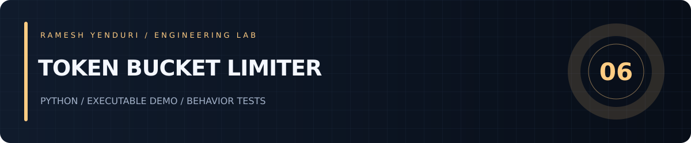

# Token Bucket Limiter



Thread-safe token bucket admission control with burst capacity and precise retry delays.

An independent engineering lab by Ramesh Yenduri. Examples use synthetic data.

## Run

Python 3.12+; standard library only, no package installation required.

```sh
python demo.py
python -m unittest -v
```

## Design and behavior

`TokenBucket.consume(cost)` returns an allowed flag, remaining tokens and seconds until the request could succeed. Fractional refills use a monotonic clock. Capacity bounds bursts while refill rate bounds sustained throughput. A lock makes admission atomic within one process. The injected clock lets tests verify refill boundaries without sleeping.

## Read the code

- `core.py` — implementation and public API.
- `demo.py` — deterministic, runnable usage example.
- `test_core.py` — behavior and failure-path tests.
- `.github/workflows/ci.yml` — runs the suite on Python 3.12 and 3.13.

## Scope and tradeoffs

A single process bucket, not a distributed limiter. It does not identify users or persist state. Very high cardinality per-user buckets would need eviction. Floating point tokens are appropriate for admission estimates, not accounting. Invalid non-finite configuration and impossible costs are rejected.
